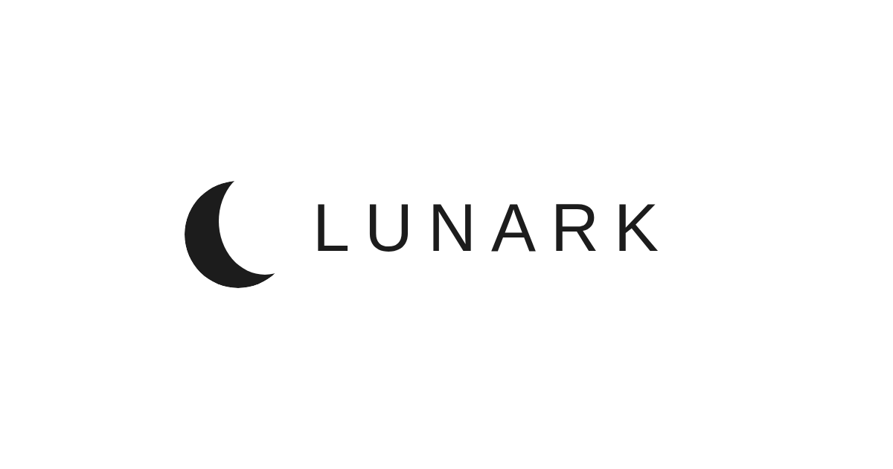

# Lunark

Modern e-commerce clothing platform rebuilt from a legacy PHP project — Next.js, Hono.js, Turso, Cloudflare, Brevo.

## Overview

Lunark is a full-stack e-commerce platform for clothing, designed with a modern, secure architecture. The project started as a basic PHP store built during a professional course (PAP — Escola Profissional de Valongo, 2024), and has been completely reimagined using current technologies and best practices. The original codebase is preserved in the [`legacy/`](legacy/) folder to show the evolution.

## Technology Stack

| Layer | Technology | Purpose |
|-------|-----------|---------|
| Frontend | Next.js 14 (App Router) + TypeScript | SSR/SSG, SEO, modern UX |
| Styling | Tailwind CSS + shadcn/ui | Responsive, component-based UI |
| API | Hono.js | Lightweight REST API |
| Database | Turso (LibSQL) | Distributed SQLite, edge-ready |
| ORM | Drizzle ORM | Type-safe database access |
| Auth | NextAuth.js v5 | OAuth + credentials, secure sessions |
| Emails | Brevo | Transactional emails and newsletters |
| Bot Protection | Cloudflare Turnstile | Invisible CAPTCHA |
| Edge Functions | Cloudflare Workers | Rate limiting, validation |
| Frontend Hosting | Vercel | Automatic deploys, global CDN |
| API Hosting | Fly.io | Dockerized API with edge deployment |
| Images | Cloudflare R2 | Product image storage |

## Features

### Customer

- User registration and login (email + Google OAuth)
- Product catalog with filters (category, price, size, color)
- Product search
- Product page with image gallery and size selection
- Persistent shopping cart
- Checkout with shipping address
- Order history
- Editable profile with password reset
- Wishlist / favorites
- Email notifications (order confirmation, shipping, promotions)
- Internationalization (PT/EN)

### Admin

- Dashboard with metrics (sales, users, stock)
- Product CRUD with image uploads
- Order management (status: pending → shipped → delivered)
- User management
- Category and collection management
- Newsletter via Brevo
- Activity logs

### Security

- Secure authentication (bcrypt, sessions, optional MFA)
- CSRF protection, rate limiting
- Input validation with Zod across the entire stack
- Prepared statements via Drizzle ORM (zero SQL injection)
- Cloudflare Turnstile on forms
- HTTPS, configured CORS, secure headers
- Environment variables for all secrets — nothing committed to source

## Project Structure

```
lunark/
├── assets/                  # Brand assets (logo)
├── legacy/                  # Original PHP project (PAP 2024)
│   ├── website/             # PHP application
│   ├── database/            # MySQL schema
│   ├── docs/                # Original PAP report
│   └── README.md
├── apps/
│   ├── web/                 # Next.js frontend (Vercel)
│   │   ├── src/
│   │   │   ├── app/         # App Router pages
│   │   │   ├── components/  # UI components (Tailwind + shadcn/ui)
│   │   │   ├── lib/         # API client, auth, utils
│   │   │   └── i18n/        # PT/EN translations
│   │   └── package.json
│   └── api/                 # Hono.js API (Fly.io)
│       ├── src/
│       │   ├── routes/      # Products, cart, orders, auth, admin
│       │   ├── middleware/   # Auth, rate-limit, CORS, validation
│       │   ├── db/          # Drizzle schema + migrations (Turso)
│       │   └── services/    # Business logic
│       ├── Dockerfile
│       └── package.json
├── packages/
│   └── shared/              # Shared types, validators, constants
├── .portfolio.json          # Portfolio sync metadata
├── .gitignore
├── LICENSE
├── README.md
└── turbo.json               # Turborepo monorepo config
```

## Legacy vs Modern

This project demonstrates a complete architectural evolution:

| Aspect | Legacy (2024) | Lunark (2026) |
|--------|---------------|---------------|
| Backend | PHP (no framework) | Hono.js + TypeScript |
| Database | MySQL (raw queries) | Turso + Drizzle ORM |
| Auth | Plain text passwords | bcrypt + NextAuth.js + OAuth |
| Security | SQL injection vulnerable | Zod validation, CSRF, rate limiting |
| Frontend | HTML/CSS/JS (no framework) | Next.js 14 + Tailwind + shadcn/ui |
| Deployment | Localhost only (XAMPP) | Vercel + Fly.io (global) |
| Architecture | Monolithic PHP scripts | Monorepo with separated concerns |
| i18n | None | Full PT/EN support |
| Email | None | Brevo transactional + newsletters |

## Local Installation

### Prerequisites

- Node.js 20+
- Free accounts: [Turso](https://turso.tech/), [Vercel](https://vercel.com/), [Cloudflare](https://cloudflare.com/)

### 1. Clone the repository

```bash
git clone https://github.com/Sam-Ciber-Dev/lunark.git
cd lunark
```

### 2. Configure environment variables

```bash
cp apps/web/.env.example apps/web/.env.local
cp apps/api/.env.example apps/api/.env
```

Never commit real `.env` files.

### 3. Install dependencies

```bash
npm install
```

### 4. Start development

```bash
npm run dev
```

## Contact

- **Email:** [sam.oliveira.dev@gmail.com](mailto:sam.oliveira.dev@gmail.com)
- **Compose in Gmail:** [Gmail](https://mail.google.com/mail/?view=cm&fs=1&to=sam.oliveira.dev@gmail.com&su=Lunark%20inquiry&body=Hi%20Samuel%2C%0A)
- **Compose in Outlook:** [Outlook](https://outlook.live.com/owa/?path=/mail/action/compose&to=sam.oliveira.dev@gmail.com&subject=Lunark%20inquiry&body=Hi%20Samuel%2C%0A)
- **LinkedIn:** [linkedin.com/in/jose-samuel-oliveira](https://www.linkedin.com/in/jose-samuel-oliveira)
- **Website:** [sam-ciber-dev.github.io](https://sam-ciber-dev.github.io/)

## License

This project is licensed under the [MIT License](LICENSE).

## Social Preview



## Badges


